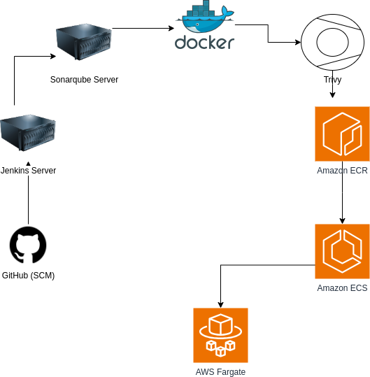

# Project Name

## Introduction
This project is a web application for hospital management.

## Architecture Overview
The architecture of this project integrates several DevOps tools and AWS services to automate the CI/CD pipeline, ensuring a smooth and reliable deployment process.

  
*Figure 1: Overall Architecture*

## Key Components
- **GitHub** – Source Code Management (SCM)
- **SonarQube** – Code Quality Analysis
- **Docker** – Containerization
- **Trivy** – Vulnerability Scanning
- **Amazon ECR** – Container Registry
- **Amazon ECS** – Orchestrating Containers (Fargate)
- **AWS CodeDeploy** – Blue/Green Deployment

## CI/CD Deployment Workflow
1. **Code Push to GitHub:** Developers commit changes to the GitHub repository.
2. **Static Code Analysis:** SonarQube scans the code for vulnerabilities and quality issues.
3. **Build Container Image:** A Docker image is created using the latest application code.
4. **Security Scan:** Trivy scans the built container image for vulnerabilities.
5. **Push to Amazon ECR:** The verified and secure image is stored in AWS ECR.
6. **Create ECS Task Definition:** A new task definition is registered to use the latest image.
7. **Deploy via AWS CodeDeploy:**
   - The `appspec.yaml` file, stored in S3, defines how ECS should deploy the new task.
   - CodeDeploy manages traffic shifting using a Blue/Green deployment strategy.
8. **Traffic Shift & Rollback Handling:**
   - CodeDeploy gradually shifts traffic from the old task to the new one using an **Application Load Balancer (ALB)**.
   - If the deployment fails, CodeDeploy can **automatically roll back** to the previous version.

  
*Figure 2: Deployment Workflow*

## AWS CodeDeploy & Blue/Green Deployment
AWS CodeDeploy automates deployment to ECS, ensuring **zero downtime** by managing traffic between:
- **Blue (Current Version):** Running in the active ECS service.
- **Green (New Version):** Deployed as a replacement, waiting for traffic shift.

When a new version is deployed, CodeDeploy gradually redirects requests from the **old target group** to the **new one**. This minimizes downtime and allows for **automatic rollback** if issues occur.

## CodeDeploy in Action
Below are some screenshots of the AWS CodeDeploy interface:

  
*Figure 3: AWS CodeDeploy Interface*

## Conclusion
This project leverages a fully automated CI/CD pipeline with **GitHub, SonarQube, Docker, Trivy, AWS ECR, ECS, and CodeDeploy**. The **Blue/Green deployment** ensures **minimal downtime** and **safe rollbacks**, providing a **scalable and secure deployment approach**.

## How to Use This Documentation
- **Understand** the system architecture.
- **Follow** the deployment workflow for troubleshooting.
- **Monitor** AWS CodeDeploy for deployment success/failure.
